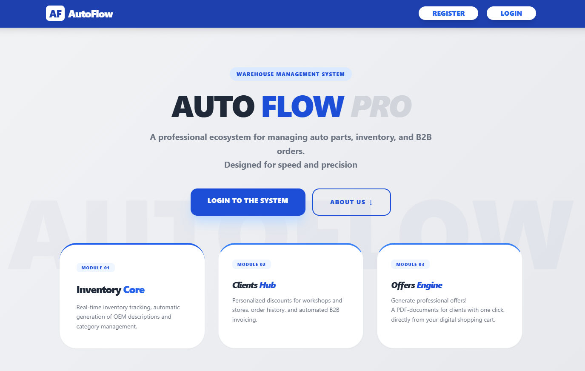
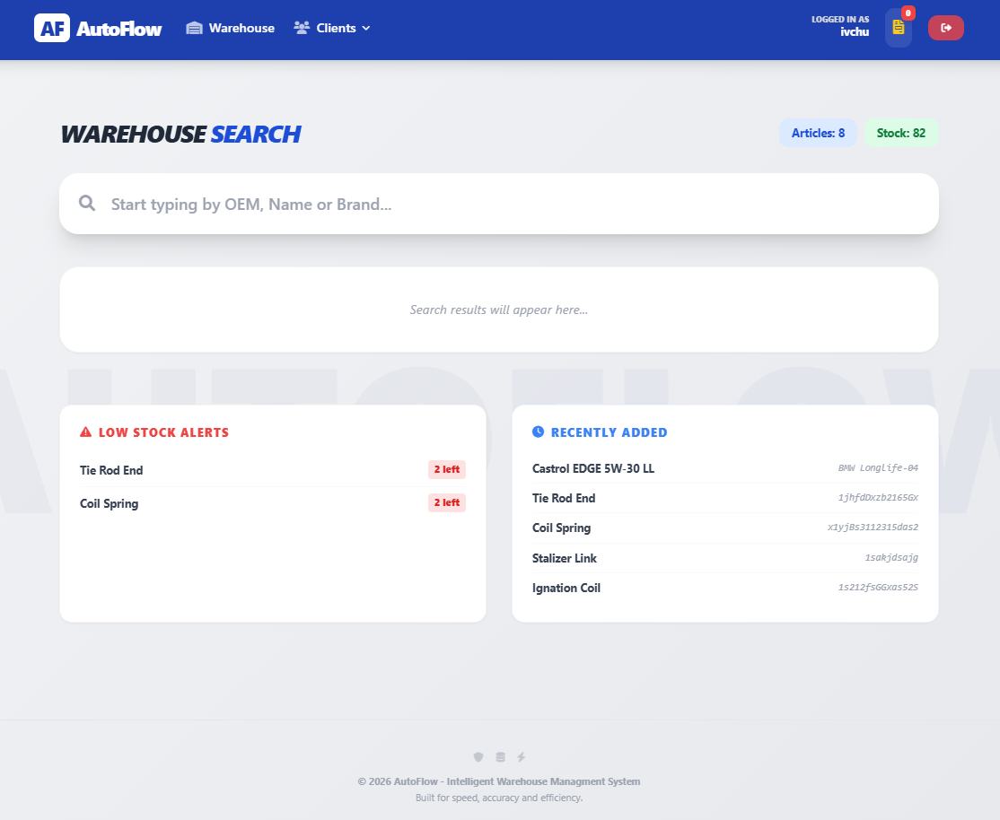
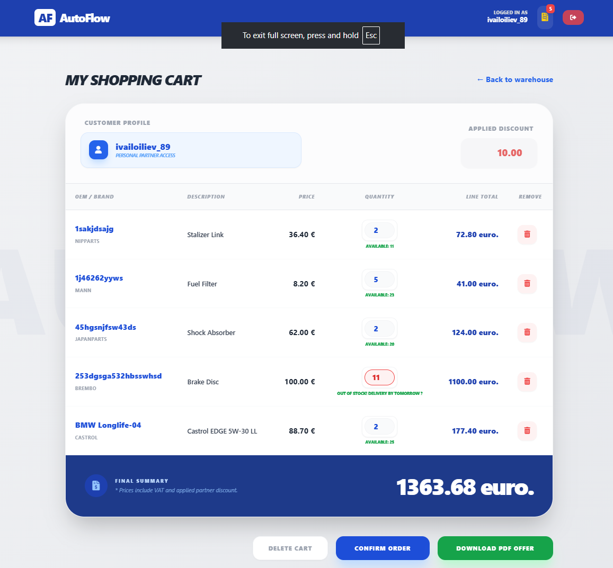
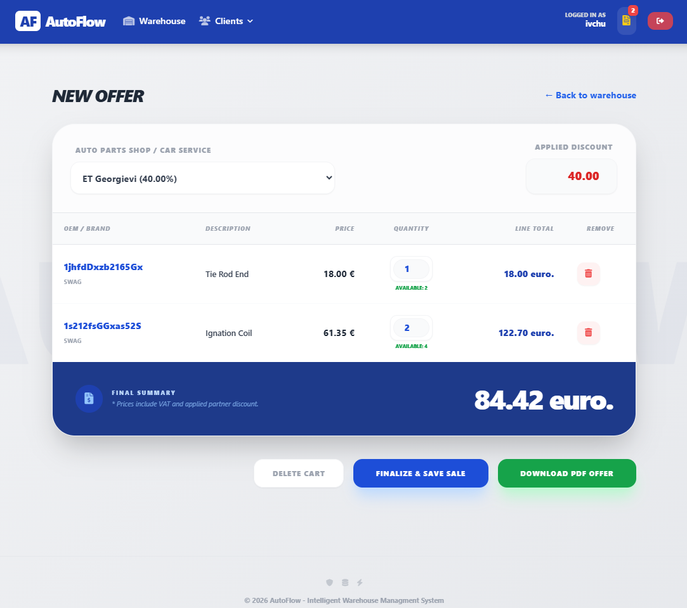
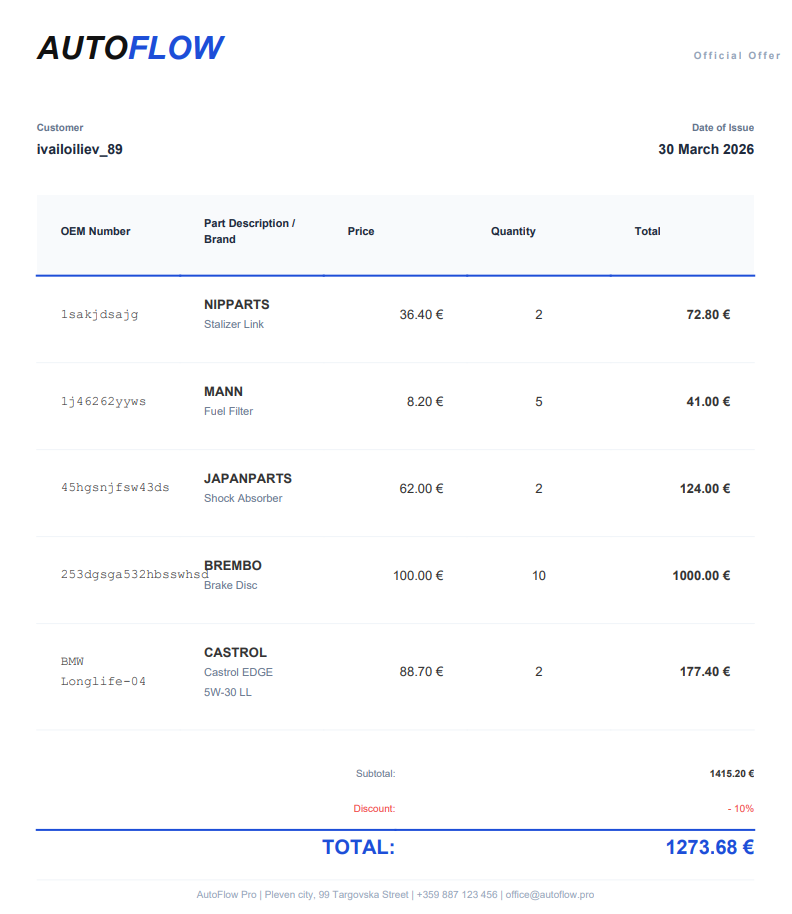
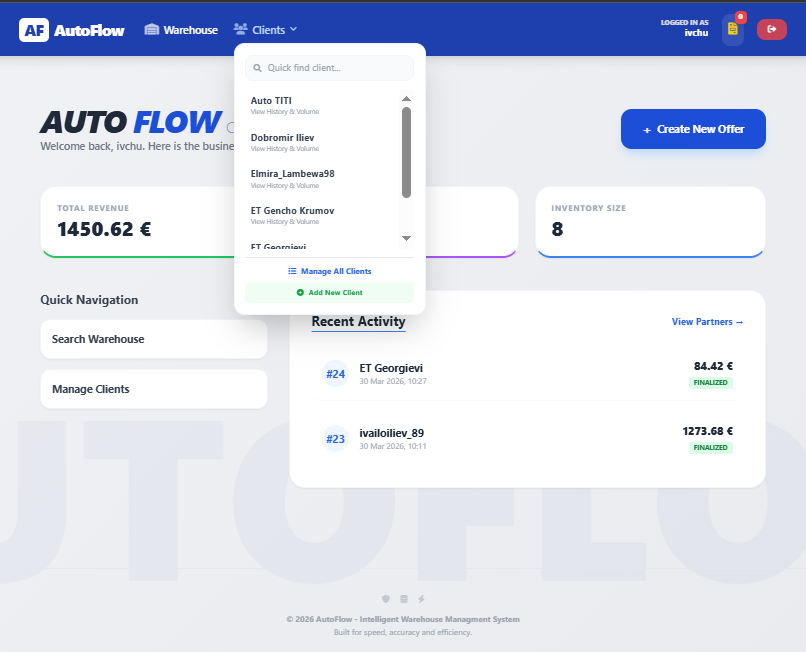
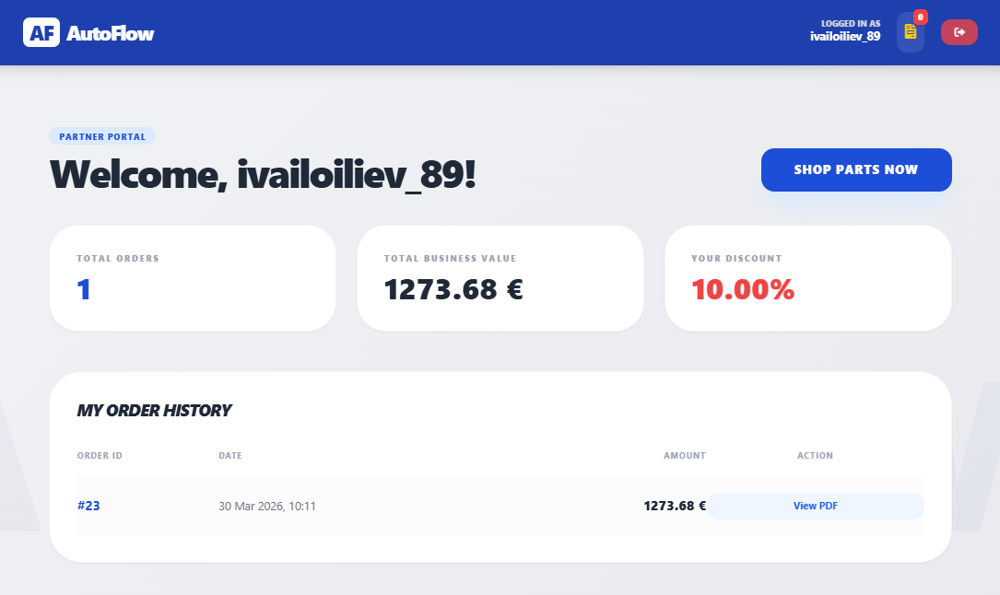
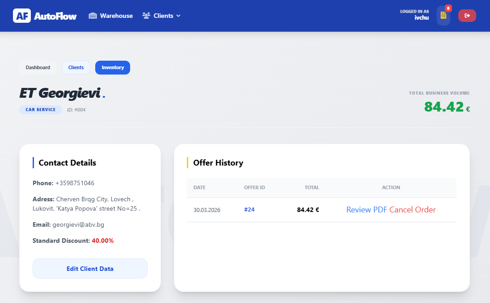

#  AutoFlow Pro
### Professional B2B Warehouse and Inventory Management System

**AutoFlow Pro** is a robust web-based ecosystem designed to bridge the gap between complex automotive inventory and streamlined B2B sales. 
By integrating real-time stock tracking with an intelligent quotation engine, it empowers warehouse managers and sales representatives to deliver precision and speed in the auto parts industry.

## ## Preview & Core Workflow

#### ### 1. Professional Interface: Landing Page

> **Visual Profile:** Modular UI featuring the "Glassmorphism" entry hub, high-contrast action buttons, and structured Module 01-03 access points for seamless system navigation.

#### 1.1 Business Ecosystem: Conversion Zone & Brand Marquee

> **Visual Profile:** Integrated B2B incentives with a 10% registration offer, contact intelligence, and a dynamic "Infinite Loop" marquee showcasing partner logos with interactive hover effects.

#### ### 2. Warehouse Command Center (Stock Management)

> **Visual Profile:** Administrative view featuring **Low-Stock Alerts**, **Recently Added** real-time inventory tracking, and smart filtering by OEM or Brand.

#### ### 3. B2B Client Workspace: Smart Quoting

> **Visual Profile:** The secure B2B dashboard where OEM search results meet personalized pricing with **automated 10% discount** calculations.Note the green status indicators showing precise stock availability and recently updated items.

#### **3.1. Advanced B2B Quotation Builder (Admin View)**

> **Visual Profile:** Demonstrates the Admin's ability to **dynamically select/switch clients** during the order process. The system automatically recalculates prices based on the selected partner's specific discount tier (`def_discount`) before finalization.

#### ### 4. Automated Commercial Proposal (PDF)

> **Visual Profile:** Instantly rendered, print-ready PDF quotations featuring VAT breakdowns and business branding.

#### ### 5. Central Business Analytics

> **Visual Profile:** High-level overview of total business volume, active clients(at dropdown menu/quick navigation or filtering by their transactional history).

#### ### 6. Security & Permission Logic (Admin vs Client)
| B2B CLIENT VIEW (Restricted) | ADMIN VIEW (Full Access) |
| :--- | :--- |
|  |  |
> **Visual Profile:** Demonstrates **Role-Based Access Control (RBAC)**. Clients are restricted to "View-only" access, while Administrators have full "Delete/Modify" authority.

### **Key Technical Features**

* **Relational Inventory Core**: <u>Engineered</u> a scalable database schema using Django ORM that <u>links</u> OEM numbers, manufacturers (Brands), and categories, <u>ensuring</u> 100% data integrity across the catalog.
* **B2B Client Hierarchy**: <u>Implemented</u> a multi-layered client logic (Service, Retail, Shop) that <u>calculates</u> and <u>applies</u> personalized loyalty discounts (`def_discount`) dynamically within the user's live session.
* **Quotation Snapshot Logic**: <u>Architected</u> a robust historical tracking system using `QuotationItem` to <u>lock</u> part prices at the moment of offer creation, <u>protecting</u> records against future price or catalog fluctuations.
* **Automated Stock Safeguard**: <u>Developed</u> server-side validation logic that <u>cross-checks</u> cart quantities against real-time `stock_qty`, <u>preventing</u> over-ordering and ensuring reliable fulfillment.
* **Dynamic UI Components**: <u>Developed</u> high-performance "Infinite Marquee" galleries using Tailwind CSS to <u>showcase</u> partner brands (Bosch, Brembo, etc.) and <u>enhance</u> platform professional credibility.
* **Custom Auth & Permissions**: <u>Defined</u> granular user roles (`is_staff` vs `is_client`) by <u>extending</u> the Django User model to <u>secure</u> administrative warehouse operations and order management.

### **Tech Stack**

* **Backend**: **Python**, **Django** (Relational ORM, Signals, Session Framework)
* **Database**: **PostgreSQL** / **SQLite** (Structured Data Mapping & Atomicity)
* **Frontend**: **HTML**, **CSS** (**Tailwind CSS Framework**), **JavaScript** (Dynamic Calculations & UI Interactivity)
* **Security**: **Role-Based Access Control (RBAC)**, **CSRF Protection**, and **Custom User Models**.
* **Environment Management**: **Python-dotenv** (Credential Decoupling)

### **What I Learned**

* **Financial Precision**: <u>Mastered</u> the use of the `Decimal` type over `Float` to <u>ensure</u> 100% accuracy in discount-heavy wholesale transactions.
* **Relational Data Modeling**: <u>Sharpened</u> skills in <u>designing</u> complex `ForeignKey` and `OneToMany` relationships to <u>associate</u> live inventory with historical quotation snapshots.
* **Business Logic Execution**: <u>Recognized</u> the vital importance of <u>creating</u> immutable data snapshots (`QuotationItem`) to <u>ensure</u> that generated documents remain accurate regardless of future price updates.
* **Advanced CSS & UX**: <u>Discovered</u> how to <u>optimize</u> user engagement by <u>deploying</u> Tailwind animations and "hover-to-pause" logic for a premium B2B aesthetic.
* **Atomic Transactions**: <u>Learned</u> to <u>protect</u> database integrity by ensuring stock deductions only occur upon successful order finalization.

### **Instructions to Setup**
1. **Clone the repository**:
   `git clone https://github.com/Ivailo-Iliev-89/AutoFlow-Pro.git`

2. **Create a Virtual Environment**:
   `python -m venv venv`

3. **Activate Virtual Environment**:
   `source venv/bin/activate` (On Windows: `venv\Scripts\activate`)

4. **Install Dependencies**:
   `pip install -r requirements.txt`

5. **Configure Environment**:
   Create a `.env` file in the root directory and populate it with your `SECRET_KEY` and database credentials.

6. **Initialize Database**:
   `python manage.py makemigrations`
   `python manage.py migrate`

7. **Create Admin Account**:
   `python manage.py createsuperuser`
   
8. **Run Server**:
   `python manage.py runserver`

### **Usage**

* **Inventory Oversight**: <u>Navigate</u> the centralized catalog to <u>filter</u> parts by OEM, Category, or Brand (e.g., Bosch, Brembo, Castrol).
* **B2B Discounting**: <u>Administer</u> partner profiles by <u>assigning</u> unique discount levels that <u>automate</u> price recalculation for every new offer.
* **Professional Quoting**: <u>Generate</u> commercial proposals by <u>adding</u> parts to the cart. The system <u>finalizes</u> total costs based on specific client pre-sets.
* **Stock Control**: <u>Monitor</u> `stock_qty` in real-time and <u>prevent</u> ordering errors through built-in server-side validation.
* **Reprint Records**: <u>Access</u> the order history to <u>view</u> or <u>re-download</u> any previously generated quotation.

### **Future Improvements**

* **Car-to-Part Compatibility**: <u>Integrate</u> a `CarMake` and `CarModel` database to <u>provide</u> a digital garage for precise vehicle-specific part matching.
* **Automated PDF Generation**: <u>Integrate</u> `WeasyPrint` to <u>export</u> professional, print-ready PDF Quotations for clients directly from the dashboard.
* **Intelligent Filtering Hub**: <u>Implement</u> high-speed filtering menus by **Vehicle Brand**, **Engine Type**, and **Category** to <u>accelerate</u> discovery.
* **Sales Analytics Dashboard**: <u>Build</u> a visual reporting tool to <u>track</u> revenue trends and top-performing OEM brands over time.

*Developed by **[Ivailo Iliev]** - Bridging Business Logic with High-Performance Software.*